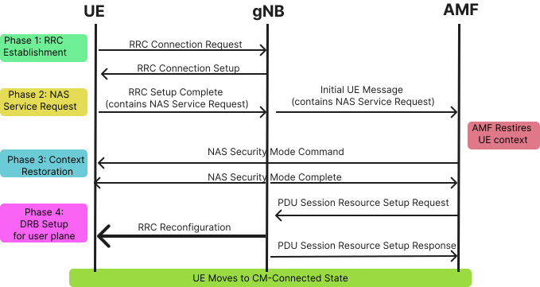
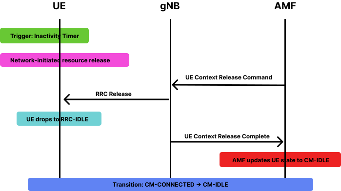

Connection Management (CM) is one of the fundamental NAS (Non-Access Stratum) functions in the 5G Core network. It defines how a User Equipment (UE) establishes, maintains, suspends, and resumes signaling connectivity with the Access and Mobility Management Function (AMF). This connectivity is essential not only for carrying user data, but also for enabling registration updates, policy enforcement, session management signaling, authentication procedures, and mobility events.

In 5G, Connection Management is designed to be more efficient and flexible than 4G LTE. With the shift to a service-based architecture (SBA), the 5G core separates signaling plane functions (AMF) from user-plane functions (UPF). This separation means that the UE's signaling connectivity must be managed intelligently to avoid unnecessary resource consumption while maintaining low latency and high availability. Two procedures are central to this behavior:

1. The Service Request procedure, which transitions a UE from CM-IDLE to CM-CONNECTED.
2. The UE Context Release procedure, which transitions a UE from CM-CONNECTED back to CM-IDLE.

Understanding these procedures is important for studying UE behavior, network resource allocation, and overall signaling architecture in 5G networks.

<strong>1. CM States in 5G</strong>

5G introduces two major NAS CM states that define the signaling connectivity between the UE and the AMF:

### 1.1 CM-IDLE State

In the CM-IDLE state, the UE does not maintain an active NAS signaling connection to the AMF. This is similar to idle mode in LTE, but 5G has improved efficiency through optimized paging, tracking areas, and RRC Inactive (introduced in 5G NR).

When the UE is in CM-IDLE:

* No dedicated RRC connection exists between the UE and the gNB.
* The AMF stores only minimal context about the UE (e.g., 5G-GUTI, Tracking Area List).
* The UE performs cell reselection autonomously and monitors paging channels.
* The UE can decode system information and access further signaling through RACH if needed.
* Inactive mode optimizations support faster transition to connectivity without full re-establishment.

CM-IDLE is a resource-saving mode. It reduces power consumption at the UE and signaling load on the network.

### 1.2 CM-CONNECTED State

In the CM-CONNECTED state:

* The UE has an active RRC connection with the gNB.
* The AMF maintains a complete UE context including keys, PDU session information, and security context.
* The UE is reachable immediately for both NAS signaling and user-plane data.
* gNB stores UE-specific RRC and DRB configurations.
* Handover procedures (intra-gNB or inter-gNB) occur only when the UE is in this state.

This state is used when the UE or the network needs frequent communication. However, maintaining this state consumes radio resources, AMF processing, and UE battery power. Therefore, the network tries to switch the UE to CM-IDLE when no active communication is required.

*Fig: CM-IDLE vs CM-CONNECTED State Diagram*

<strong>2. Service Request (CM-IDLE → CM-CONNECTED)</strong>

The Service Request procedure is responsible for restoring the UE's NAS signaling connectivity and user-plane paths after they have been released due to inactivity or policy constraints.

It is one of the most frequently executed signaling procedures in a live 5G network, especially for mobile applications that generate intermittent bursts of traffic (e.g., messaging apps, IoT devices, background sync services).

### 2.1 Why Service Request Is Needed

In CM-IDLE:

* The UE cannot transmit uplink data immediately.
* The gNB does not maintain RRC context.
* Downlink data cannot be delivered unless the network pages the UE.

When the UE needs to send or receive data, it must perform a Service Request to restore full connectivity. Without this procedure, 5G would be inefficient, as every small data packet would require complete registration, creating overhead.

### 2.2 Types of Service Request

There are two categories:

#### 2.2.1 Mobile-Originated (MO) Service Request

Triggered by the UE when:

* The user opens an application requiring connectivity.
* The UE needs to send uplink data (e.g., app sync).
* The UE wants to resume suspended PDU sessions.
* The UE needs NAS signaling for mobility or SMF interaction.

#### 2.2.2 Mobile-Terminated (MT) Service Request

Triggered by the network when:

* Downlink data arrives at the UPF destined for the UE.
* The UPF sends "Downlink Data Notification" to the SMF.
* SMF forwards this to the AMF.
* The AMF initiates paging.
* UE responds and begins the Service Request procedure.

This mechanism ensures the UE remains reachable with minimal resource consumption.

### 2.3 Step-by-Step Signal Flow of UE-Triggered Service Request

#### Step 1: UE initiates RRC Connection Establishment

Since the UE is idle, the first step is to create RRC connectivity with the gNB.

The UE sends:

* RRC Connection Request (UE → gNB)

Based on network admission control, the gNB replies with:

* RRC Connection Setup

UE responds with:

* RRC Connection Setup Complete

This message includes the NAS Service Request.

#### Step 2: gNB Forwards Service Request to AMF

The gNB receives the NAS message and forwards it to the AMF using N2 signaling.

The AMF then identifies the UE using:

* 5G-GUTI
* Stored mobility context

#### Step 3: Security Validation and Context Restoration

The AMF may:

* Re-establish or refresh NAS security
* Retrieve stored PDU session context from SMF(s)
* Validate UE authorization for services

This step ensures secure and authenticated communication.

#### Step 4: Coordination Between AMF and SMF

If user-plane resources were previously released:

* AMF contacts respective SMF instances.
* SMF re-establishes N3 tunnel with the UPF.
* gNB is informed to prepare DRBs.

This step reactivates user data paths.

#### Step 5: DRB Setup at gNB

The AMF sends an N2 message:

* PDU Session Resource Setup Request

gNB sets up radio bearers (DRBs) necessary for data flow and responds:

* PDU Session Resource Setup Response

#### Step 6: UE Transitions to CM-CONNECTED

Once signaling and data paths are restored, the AMF marks the UE as CM-CONNECTED.

The UE can now send/receive data without further delay.

This completes the Service Request procedure.

*Fig: 5G Service Request Sequence Flow (UE-triggered)*

<strong>3. UE Context Release (CM-CONNECTED → CM-IDLE)</strong>

The UE Context Release procedure is equally important. It prevents resource wastage by moving the UE from CM-CONNECTED to CM-IDLE when connectivity is no longer needed.

### 3.1 Why UE Context Release Is Needed

Keeping a UE in CM-CONNECTED consumes:

* RRC resources on gNB
* Processing cycles at AMF
* Memory for UE context
* Prolonged battery usage on UE

Most UEs do not continuously send or receive data. Applications typically operate in short bursts followed by long idle periods. Therefore, when the AMF detects inactivity or when network policy dictates, the UE context is released.

This ensures the network can support millions of devices efficiently.

### 3.2 Triggering Conditions for UE Context Release

1. **Inactivity Timer Expiry**
   
   The most common reason. If no NAS or user-plane activity occurs for a configured duration, the AMF triggers release.

2. **UE-Initiated Deregistration**
   
   When the UE:
   * Powers off
   * Switches to airplane mode
   * Explicitly deregisters

3. **Abnormal Conditions**
   
   Examples:
   * Failed handovers
   * Radio link failures
   * gNB-initiated release

4. **Policy-Based Release**
   
   Operator-configured behavior (e.g., IoT device optimizations).

### 3.3 Detailed Step-by-Step Signal Flow of UE Context Release

#### Step 1: AMF Issues UE Context Release Command

After inactivity or explicit event, the AMF sends:

* UE Context Release Command (AMF → gNB)

This informs the gNB to remove RRC state and data path.

#### Step 2: gNB Releases RRC Connection

The gNB:

* Releases dedicated radio resources.
* Sends RRC Release to the UE.

Now, the UE enters RRC-IDLE mode.

#### Step 3: gNB Confirms Release

The gNB sends:

* UE Context Release Complete (gNB → AMF)

AMF now updates the UE state to CM-IDLE.

#### Step 4: AMF Maintains Only Minimal Context

The UE is tracked using:

* Latest Tracking Area ID
* Paging information
* 5G-GUTI

This allows efficient reachability for future Service Requests or paging.

*Fig: UE Context Release Sequence Flow*

