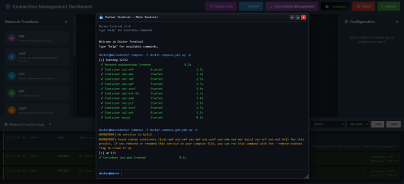
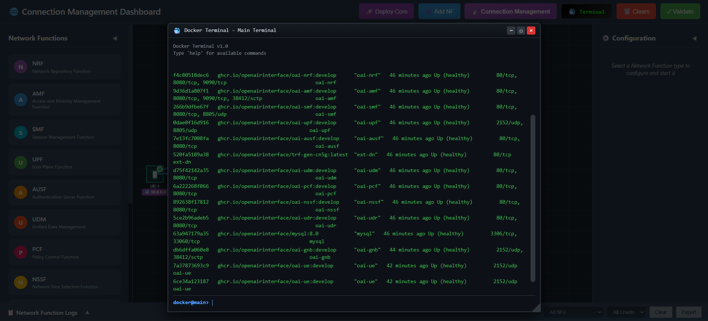
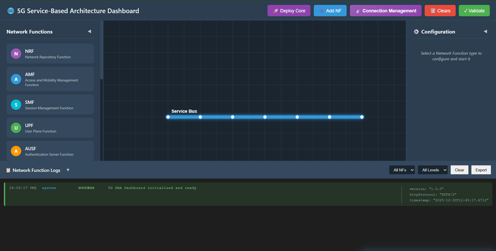
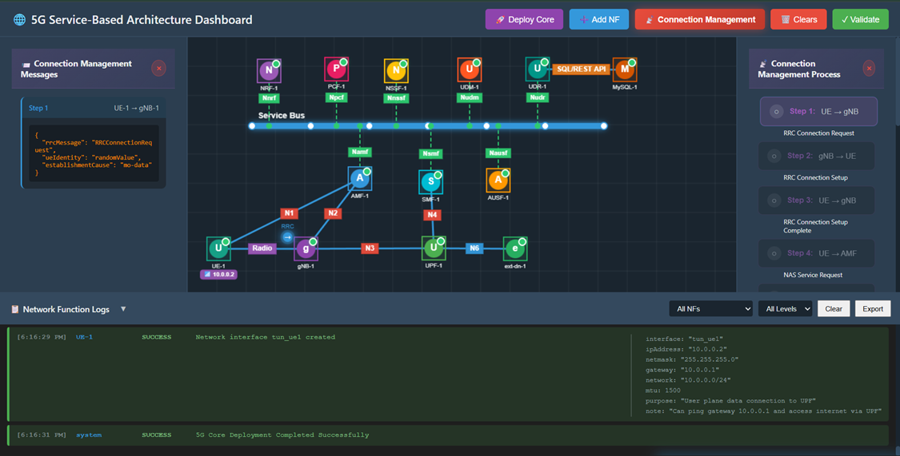
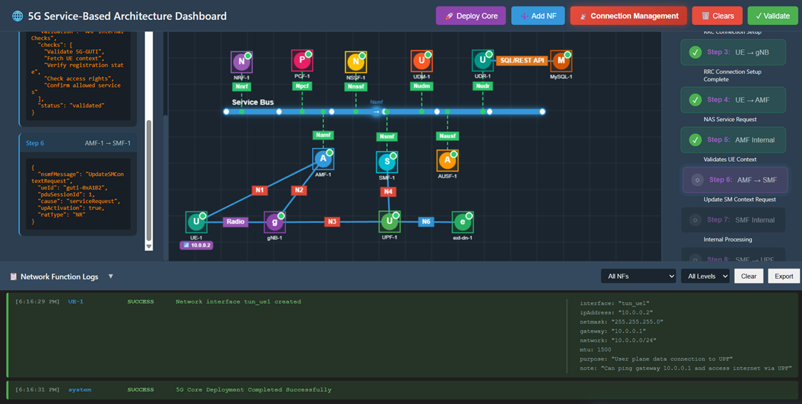
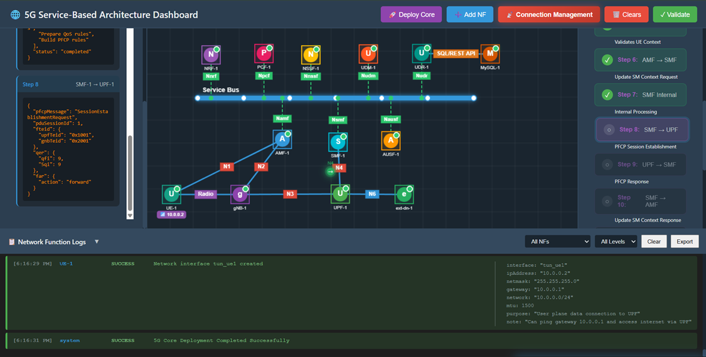
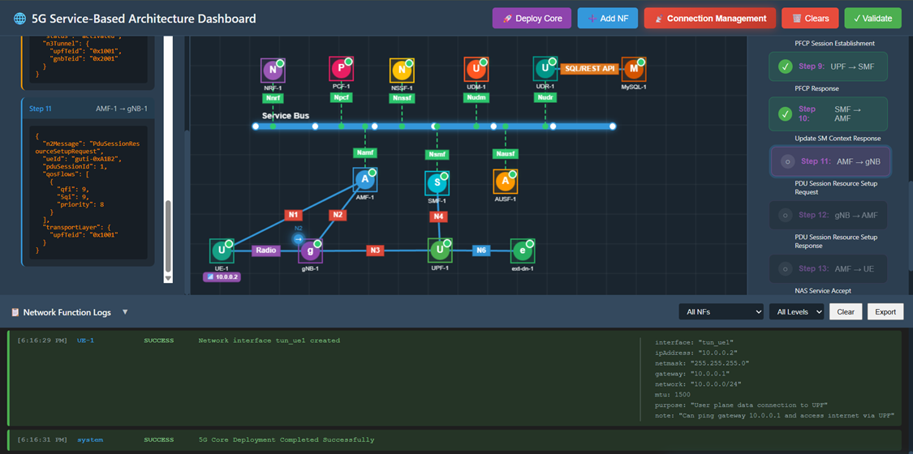
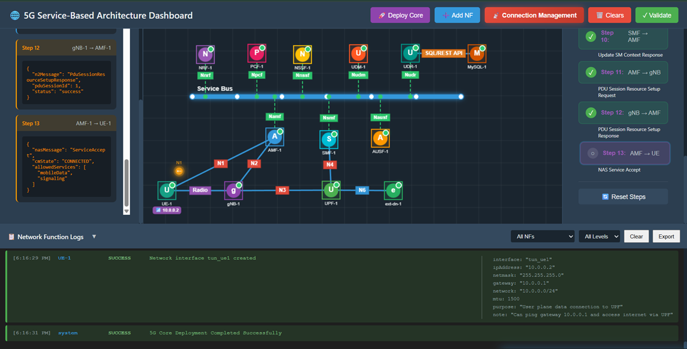

## Step 1: Deploy Core Network

**Option A (Terminal):**
Click on the **Terminal button** to open the terminal then from the project root directory, execute the following command:


This command starts all core network components (AMF, SMF, UPF, NRF, etc.) in detached mode

```bash
docker compose -f docker-compose.yml up -d
```


# Once the core network is up and running, deploy the gNB services:

```bash
 docker compose -f docker-compose-gnb.yml up -d
 ```
This command initializes the gNB and establishes connectivity with the core network.




# After the gNB deployment is complete, deploy the UE services:


```bash
docker compose -f docker-compose-ue.yml up -d
```
This starts the UE containers and attaches them to the gNB.


# To verify that all containers are running successfully, execute:

```bash
docker ps
```



# To continuously monitor the status of the core network containers, use:

```bash
watch docker compose -f docker-compose.yml ps -a
```


**Option B (Automatic):** Click the **🚀 Deploy Core** button on the top toolbar. This will automatically clear any existing topology and sequentially deploy the Service Bus, Network Functions (NRF, AMF, SMF, UPF, AUSF, UDM, PCF, NSSF, UDR, MySQL, gNB, UE), and establish the necessary connections.



**Option C (Manual):** Manually add each Network Function using the **➕ Add NF** button and connect them using the **Select Source** and **Select Destination** buttons in the left sidebar.

---

## Step 2: Enable Connection Management Mode

Once the core network is successfully deployed and all NFs show a "Stable" status, click on the **📡 Connection Management** button in the top toolbar to switch the interface to the Connection Management experiment mode.


*Fig: Connection Management Mode*

---

## Step 3: Observe Experiment Panels

You will now see:

- **Right Panel (Connection Management Process):** A step-by-step interactive flow with 13 steps for the complete connection management process.
- **Left Panel (Connection Management Messages):** An inspector panel that displays the JSON content of every Request and Response message sent between NFs.


*Fig: Experiment Panels*

---

## Step 4: RRC Connection Request

Click **Step 1** in the right panel.

- **Action:** UE sends an RRC Connection Request to the gNB to establish radio connection.
- **Observation:** A packet travels from UE to gNB. The left panel shows the RRC message details including rrcMessage, ueIdentity, and establishmentCause.



*Fig: RRC Connection Request*

---

## Step 5: RRC Connection Setup

Click **Step 2** in the right panel.

- **Action:** gNB responds with RRC Connection Setup, allocating radio resources.
- **Observation:** A packet travels from gNB to UE. The left panel shows the RRC Connection Setup with SRB1 configuration.


*Fig: RRC Connection Setup*

---

## Step 6: RRC Connection Setup Complete

Click **Step 3** in the right panel.

- **Action:** UE confirms RRC connection establishment and includes NAS Service Request.
- **Observation:** A packet travels from UE to gNB. The message contains embedded NAS PDU with Service Request.


*Fig: RRC Connection Setup Complete*

---

## Step 7: NAS Service Request

Click **Step 4** in the right panel.

- **Action:** UE sends NAS Service Request to AMF via N1 interface to request PDU session.
- **Observation:** A packet travels from UE to AMF. The left panel displays the NAS message with 5G-GUTI, service type, and PDU session status.


*Fig: NAS Service Request*

---

## Step 8: AMF Validates UE Context

Click **Step 5** in the right panel.

- **Action:** AMF performs internal validation of UE context and credentials.
- **Observation:** The left panel shows AMF internal checks including validation of 5G-GUTI, UE context fetch, and access rights verification.


*Fig: AMF Validates UE Context*

---

## Step 9: Update SM Context Request

Click **Step 6** in the right panel.

- **Action:** AMF forwards the service request to SMF via Nsmf_PDUSession interface.
- **Observation:** A packet travels from AMF to SMF. The message includes ueId, pduSessionId, and upActivation flag.



*Fig: Update SM Context Request*

---

## Step 10: SMF Internal Processing

Click **Step 7** in the right panel.

- **Action:** SMF performs internal processing to prepare for UPF session establishment.
- **Observation:** The left panel shows SMF processing actions including UPF selection, TEID allocation, and PFCP rules preparation.


*Fig: SMF Internal Processing*

---

## Step 11: PFCP Session Establishment Request

Click **Step 8** in the right panel.

- **Action:** SMF sends PFCP Session Establishment Request to UPF via N4 interface to create user plane session.
- **Observation:** A packet travels from SMF to UPF. The response JSON contains the tunnel TEIDs (upfTeid: 0x1001, gnbTeid: 0x2001) and QoS parameters.



*Fig: PFCP Session Establishment Request*

---

## Step 12: PFCP Session Establishment Response

Click **Step 9** in the right panel.

- **Action:** UPF confirms session establishment and returns success response.
- **Observation:** A packet travels from UPF to SMF. The response confirms successful PFCP session establishment.


*Fig: PFCP Session Establishment Response*

---

## Step 13: Update SM Context Response

Click **Step 10** in the right panel.

- **Action:** SMF sends Update SM Context Response back to AMF with tunnel information.
- **Observation:** A packet travels from SMF to AMF. The message includes session status as "activated" and N3 tunnel details.


*Fig: Update SM Context Response*

---

## Step 14: PDU Session Resource Setup Request

Click **Step 11** in the right panel.

- **Action:** AMF instructs gNB to setup PDU session resources via N2 interface.
- **Observation:** A packet travels from AMF to gNB. The message contains QoS flows with QFI 9, 5QI 9, and transport layer information.



*Fig: PDU Session Resource Setup Request*

---

## Step 15: PDU Session Resource Setup Response

Click **Step 12** in the right panel.

- **Action:** gNB confirms PDU session resource setup and provides gNB tunnel endpoint.
- **Observation:** A packet travels from gNB to AMF. The response includes the gNB TEID (0x2001) and success status.



*Fig: PDU Session Resource Setup Response*

---

## Step 16: NAS Service Accept

Click **Step 13** in the right panel.

- **Action:** AMF sends final NAS Service Accept message to UE, confirming PDU session is established.
- **Observation:** A packet travels from AMF to UE. The UE receives confirmation that the PDU Session is marked as Established. The connection management process is now complete.


*Fig: NAS Service Accept*
